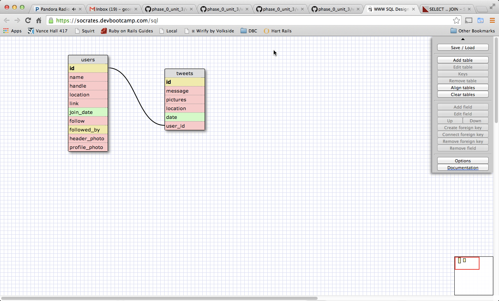

# U3.W7: Modeling a Real-World Database (SOLO CHALLENGE)

## Release 0: Users Fields
<!-- Identify the fields Twitter collects data for -->
1. name
2. handle
3. location
4. link
5. join_date
6. follow
7. followed_by
8. header_photo
9. profile_photo

## Release 1: Tweet Fields
<!-- Identify the fields Twitter uses to represent/display a tweet. What are you required or allowed to enter? -->

1. 140 character message
2. pictures
3. location
4. date

## Release 2: Explain the relationship
The relationship between `users` and `tweets` is: 
<!-- because... -->

One user to many tweets.  They are connected by a user ID number that connects many tweets to one user's ID

## Release 3: Schema Design
<!-- Include your image (inline) of your schema -->

## Release 4: SQL Statements
<!-- Include your SQL Statements. How can you make markdown files show blocks of code? -->

all the tweets for a certain user id

SELECT message
FROM tweets
GIVEN user_id = '###'

the tweets for a certain user id that were made after last Wednesday (Whenever last Wednesday was for you)

SELECT message
FROM tweets
GIVEN user_id = '###' AND date >6/18/2014

all the tweets associated with a given user's twitter handle

SELECT tweets.message
FROM tweets JOIN users
ON (tweets.user_id = users.id)
GIVEN users.handle = '###'

the twitter handle associated with a given tweet id

SELECT users.handle
FROM users JOIN tweets
ON (users.id = tweets.user_id)
GIVEN tweets.user_id = '###'

## Release 5: Reflection
<!-- Be sure to add your reflection here!!! -->

SQL thankfully is relatively simple, straightforward syntax.  Would like to practice more JOINs, but other than that, seems realtively straightforward.  Would also like to better understand how to store images - right now, storing them as varbin, but may be a better way