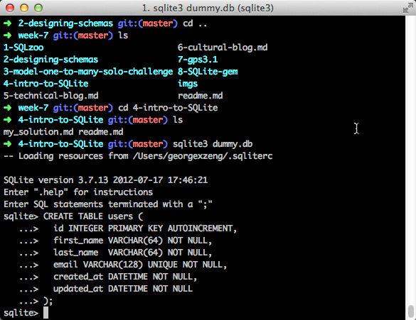
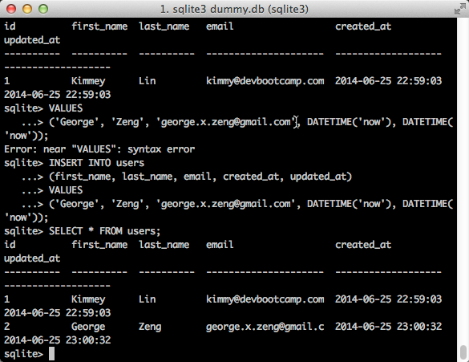
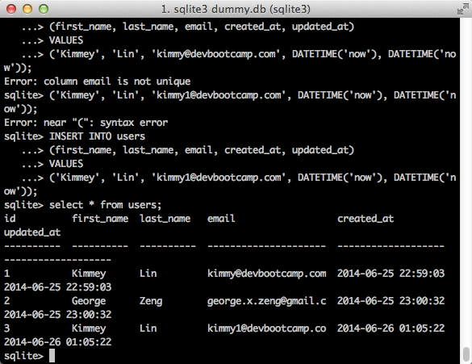
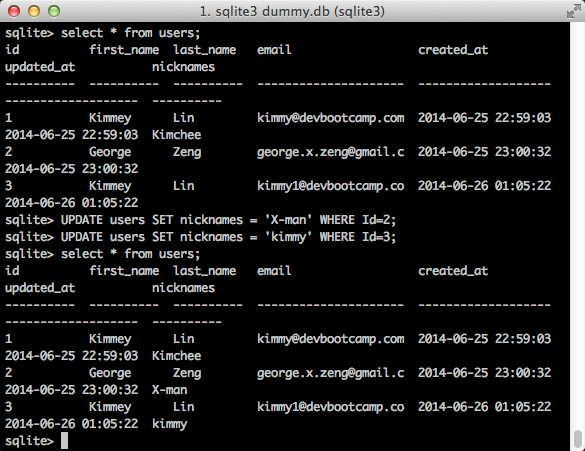
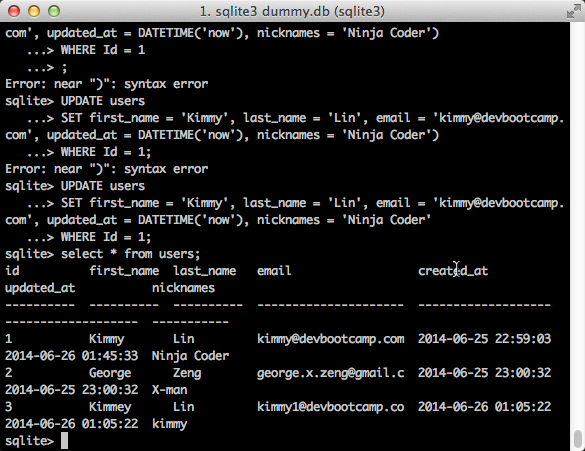

# U3.W7: Intro to SQLite

## Release 0: Create a dummy database

<!-- paste your terminal output here -->

## Release 1: Insert Data 
<!-- paste your terminal output here -->

## Release 2: Multi-line commands
<!-- paste your terminal output here -->

## Release 3: Add a column
<!-- paste your terminal output here -->

## Release 4: Change a value
<!-- paste your terminal output here -->

## Release 5: Reflect
<!-- Add your reflection here -->

SQL Lite tutorial very helpful; also feel would be helpful to go back and finish SQL Zoo tutorials